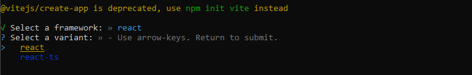

# 01 - Create React App

Existen varias formas para iniciar un proyecto en react, la forma más básica es usando create-react-app (es una forma poco eficiente). Existen otras formas más rápidas como Vite (es una forma muy optimizada). 

Ambas nos dan todo lo necesario para crear una aplicación en React (localhost, empaquetador, ...). Más información en el video explicativo. 

Video explicativo: [https://www.youtube.com/watch?v=KXzLyHr8UVE](https://www.youtube.com/watch?v=KXzLyHr8UVE)

⚠️ Es necesario tener instalado node, para comprobarlo usar el comando npx --version

# Create-Rect-App

Guía oficial: [https://create-react-app.dev/docs/getting-started](https://create-react-app.dev/docs/getting-started)

```bash
npx create-react-app my-app
cd my-app
npm start
```

# Vite

Guía oficial: [https://vitejs.dev/guide/#scaffolding-your-first-vite-project](https://vitejs.dev/guide/#scaffolding-your-first-vite-project) 

Video explicativo: [https://www.youtube.com/watch?v=NHj-awYcwUI](https://www.youtube.com/watch?v=NHj-awYcwUI)

Articulo explicativo: [https://carlosazaustre.es/react-vite](https://carlosazaustre.es/react-vite)

Para React se haría de la siguiente forma (necesario tener instalado NodeJS para tener acceso al gestor de paquetes): 

```bash
npm init @vitejs/app nombre-proyecto-vite --template react
```




```bash
Done. Now run: 
cd nombre-proyecto-vite
npm install
npm run dev
```

Existe otras formas para la instalación ( [https://carlosazaustre.es/react-vite](https://carlosazaustre.es/react-vite) ).

# Estructura de directorios

Video explicativo ( Vite ): [https://www.youtube.com/watch?v=J_ZmtP9xNg8&t=312s](https://www.youtube.com/watch?v=J_ZmtP9xNg8&t=312s)

Las rutas de React se gestiona desde JS, busca primero un archivo estático (primero en public y luego en src) y si no lo encuentra te devuelve el main o index. Si se busa con una extensión si se produce un 404. Demostración el el video explicitico minuto 5:29.

### src

Index.js (cra) o main.jsx (vite) es el punto inicial de la aplicación. Contendrá los archivos de nuestra aplicación .jsx o .js. Podremos encontrar otras carpetas dentro del src como la carpeta components, helpers, hooks, ...

```jsx
// Index.js (cra) o main.jsx (vite) 
// https://es.reactjs.org/docs/rendering-elements.html

import ReactDOM from "react-dom";

/// React representa HTML en la página web mediante el uso de una 
/// función llamada ReactDOM.render(codigo html app, elemento html div root).

const app = <h1> Desarrollo Util </h1>;
const container = document.getElementById("root");

ReactDOM.render(app, container);
```

Otro archivo que podemos encontrar en el src son los estilos css. Existe una forma no muy usada que es importarlo en el index.html, pero la forma habitual es haciéndolo dentro de un archivo js o jsx.  Por ejemplo, para importar css dentro del index.js se tiene que escribir la extensión. 

```jsx
// El empaquetador hace esto posible
import './index.css';
```

### public

La representación de React se hace dentro de un nodo raíz que se encuentra en index.html (donde se muestra toda nuestra aplicación).

```jsx
// Lo llamamos un nodo “raíz” porque todo lo que esté dentro de 
// él será manejado por React DOM.
// index.html

<div id="root"></div>
```

Las aplicaciones construidas solamente con React usualmente tienen un único nodo raíz en el DOM. 

Dentro de **package.json** encontramos los **scripst**, que son comandos para arrancar el proyecto, crear el build de producción, ... Dependiendo si se ha instalado con CRA o Vite tendrá unos comandos diferentes. Por ejemplo para arrancar el servidor con CRA es con start y con vite es con dev.

Cuando ejecutamos el **build de producción** en vite se llama dist y en CRA se llama build. Cuando se ejecuta el comando de build de producción se minifica el código, se ofusca y se optimiza. 

En vite para ver el build de producción se ejecuta vite npm run preview.